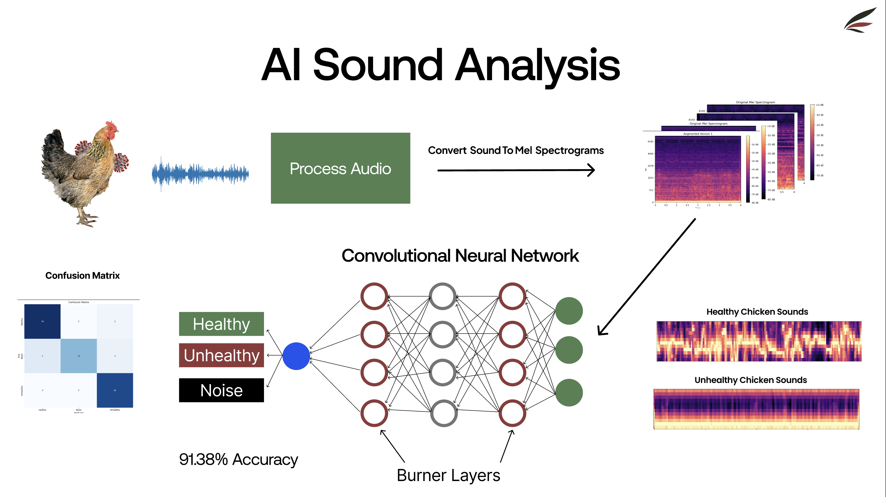
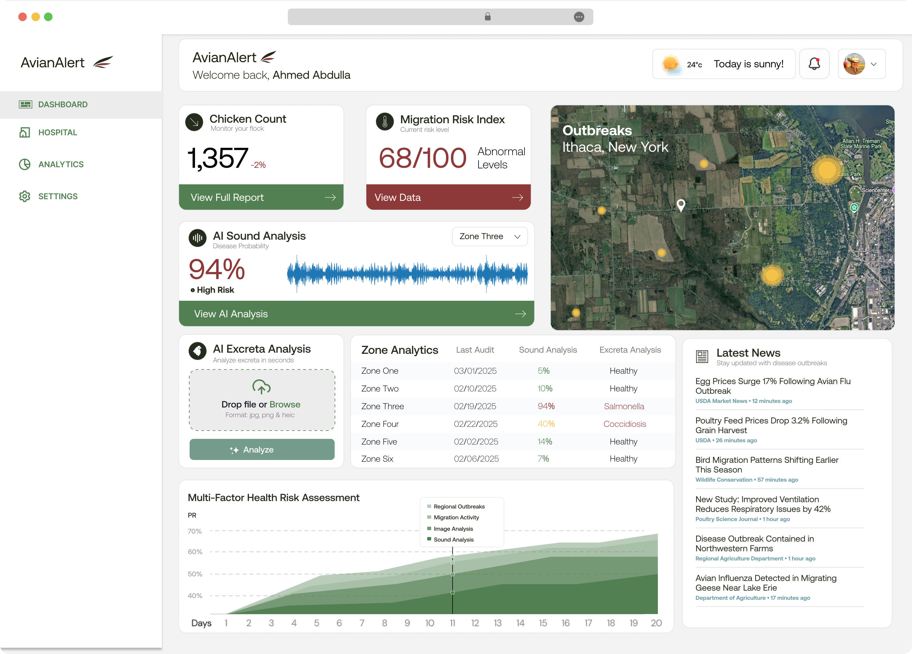

# AvianAlert: Early Detection, Immediate Action

A comprehensive AI monitoring system that helps farmers detect poultry diseases early through audio analysis and image classification. Developed for the Cornell Institute for Digital Agriculture Hackathon 2025.


## The Problem

Each year, millions of chickens die from disease. Recent outbreaks have been especially devastating:
- $600M in economic losses in the last quarter
- 20M dead chickens in the last quarter
- 96.4% increase in egg prices since last year
- $100M losses for American farmers
  

## Our Solution

AvianAlert addresses these challenges through three key components:

1. **Flock Segmentation**: Divides facilities into monitored zones to prevent rapid disease spread and enable precise outbreak identification

2. **AI Sound Analysis**: Uses deep learning to classify poultry vocalizations and detect disease early

3. **AI Excreta Analysis**: Analyzes chicken droppings to identify specific diseases (Salmonella, NCD, Coccidiosis, Avian Flu)


## Technical Implementation

### Audio Classification Model

Our CNN with Burn Layer technology classifies poultry sounds into:
- Healthy
- Unhealthy
- Noise (environmental sounds)

**Performance Metrics:**
- **Accuracy**: 91.38%
- **Unhealthy class**: 100% sensitivity - critical for ensuring no sick birds are missed
- **Implementation**: Converts audio to mel spectrograms, processes through CNN with specialized Burn Layers for noise resistance

### Image Classification Model

We implemented an EfficientNetB0 architecture to classify chicken excreta images:
- Healthy
- Salmonella
- Newcastle Disease (NCD)
- Coccidiosis
- Avian Flu

## Dashboard & User Interface

Our web-based dashboard provides:
- Health risk indicators with sound analysis visualization
- Outbreak mapping with zone-based monitoring
- Multi-factor health risk assessment
- Chicken count monitoring
- Migration risk index


## Video Demo
[Watch my video on AI Sound Analysis](https://youtu.be/9Hm3L285lUQ)


## Sustainability Impact

- **Lower Carbon Footprint**: Fewer chicken deaths reduce waste (food, water, energy)
- **Food Security**: More stable egg production improves access to affordable protein
- **Economic Impact**: Reduced disease losses increase farmer profits and stabilize supply

## Market Readiness

- **Deployment-Ready Models**: Our AI models are trained and ready for real-world implementation
- **Low Initial Cost**: Farmers only need a microphone and smartphone to use our system
- **Scalability**: Disease prevention strengthens food systems and ensures long-term sustainability

## Financial Overview

- **Cost per chicken**: $0.08 per year
- **Potential revenue**: $100M
- **Total global savings**: $2B
- **Global farm savings**: $500M

## Installation

```bash
# Clone the repository
git clone https://github.com/ahmed-52/avianAlert.git
cd avianAlert

# Install dependencies
pip install -r requirements.txt

# Download pre-trained models
python download_models.py
```

## Usage

```python
# Audio classification
from models.audio_classifier import BurnLayerModel

model = BurnLayerModel.load_pretrained()
health_status = model.predict('path/to/audio.wav')

# Image classification
from models.image_classifier import EfficientNetClassifier

classifier = EfficientNetClassifier.load_pretrained()
disease_prediction = classifier.predict('path/to/image.jpg')
```

## Team

- **Ahmed Abdulla**
- **Farhan Mashrur**
- **Suresh Kamath Bola**
- **Kiyam Merali**

## License

Educational Use License

This software is provided for educational purposes only. You may use, modify, and distribute this code for educational and non-commercial purposes. Commercial use, sale, or incorporation into commercial products is prohibited without explicit permission from the authors.
